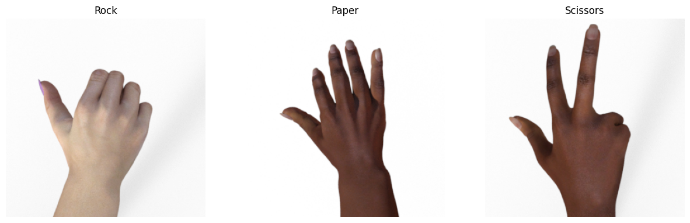

# Modul-6-Machine-Learning

# Dataset
Dataset yang digunakan yaitu RPS:

- **Rock**
- **Paper**
- **Scissors**

Splitting dataset: 70% train, 5% test & 25% validation 

# *Model*
Menggunakan Model VGG19, melakukan Image Generator dengan melakukan 10 epoch

Summary Model VGG19

# *VGG19*
VGG19 adalah model arsitektur Convolutional Neural Network (CNN) yang dikenal luas dalam dunia pengolahan gambar dan kompetisi pengenalan gambar.

# *Akurasi* 
akurasi yang di dapatkan adalah

Accuracy: 100.00%

Loss: 0.0021585780195891857
